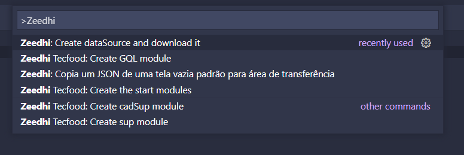
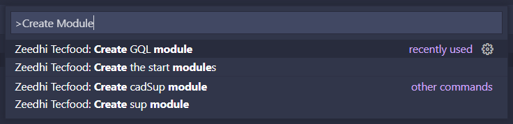

# Zeedhi-ext

Uma extensão para ajudar o desenvolvimento do Zeedhi Framework criado pela Teknisa Software, somente para uso interno.

Zeedhi é um framework que usa JSON para criar os arquivos HTML/CSS.

Se houver algum problema ou ideia para melhorar a extensão pode enviar um e-mail para: paulo.oliveira@teknisa.com

# Porque instalar?

Nós fazemos você programar para o Zeedhi bem mais rápido, forncendo para você os snippets mais usados para programar tando em JSON, JavaScript ou PHP.

Você pode fazer o que exemplos mostram:

### Exemplo JSON:

### Exemplo Javascript:

### Exemplo de comandos:

### Exemplo de modulos:

# Recomandações

Eu recomendo para melhorar seu desenvolvimento instalar as inteções abaixo:

* [Bracket Pair Colorizer 2](https://marketplace.visualstudio.com/items?itemName=CoenraadS.bracket-pair-colorizer-2)
* [JSON Organizer](https://marketplace.visualstudio.com/items?itemName=rintoj.json-organizer)

**Elas não são obrigatórias, mas irão ajudar bastante no desenvolvimento**

# Zeedhi Framework Docs

Você poder ver uma documentação completa aqui: https://github.com/paulorievrs/ZeedhiDocs

## Como contruibuir
1. Cria um fork para esse projeto
2. Crie uma branch com uma nova feature (`git checkout -b feature/newFeature`)
3. Crie um Commit (`git commit -m 'Add some newFeature'`)
4. Faça um Push na Branch (`git push origin feature/newFeature`)
5. Abre uma pull request

ou crie uma issue **ISSUE**

**Enjoy!**
