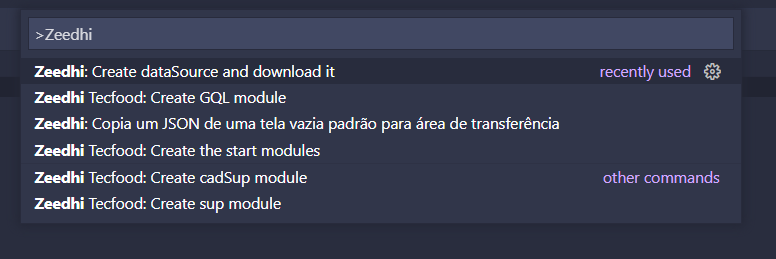

# Zeedhi-ext

An extension for help the development of Zeedhi Framework create by Teknisa Software, just for intern use.

Zeedhi is a framework that uses JSON to create their HTML/CSS files.

For any problem or idea to improve you can email to: paulo.oliveira@teknisa.com

# Why to install?

We make you code to Zeedhi faster, giving you the most usable snippets to code either to JSON, JavaScript or PHP.

You can download modules easily from the extension commands. See more bellow:

### JSON Example:

### Javascript Example:

### Commands:

### Modules to download:

# Recommended

I recommend to improve your development with this extension to install the extensions above:

* [Bracket Pair Colorizer 2](https://marketplace.visualstudio.com/items?itemName=CoenraadS.bracket-pair-colorizer-2)
* [JSON Organizer](https://marketplace.visualstudio.com/items?itemName=rintoj.json-organizer)

**They are not mandatory to this extension works, but, will make you code faster and better.**

# Zeedhi Framework Docs

You can view a Documentation Developed by me here: https://github.com/paulorievrs/ZeedhiDocs

## How to contribute

1. Create a Fork of the project
2. Create a branch with a new feature (`git checkout -b feature/newFeature`)
3. Create a Commit (`git commit -m 'Add some newFeature'`)
4. Create a Push no Branch (`git push origin feature/newFeature`)
5. Open a Pull Request 

or create a **ISSUE**

**Enjoy!**
